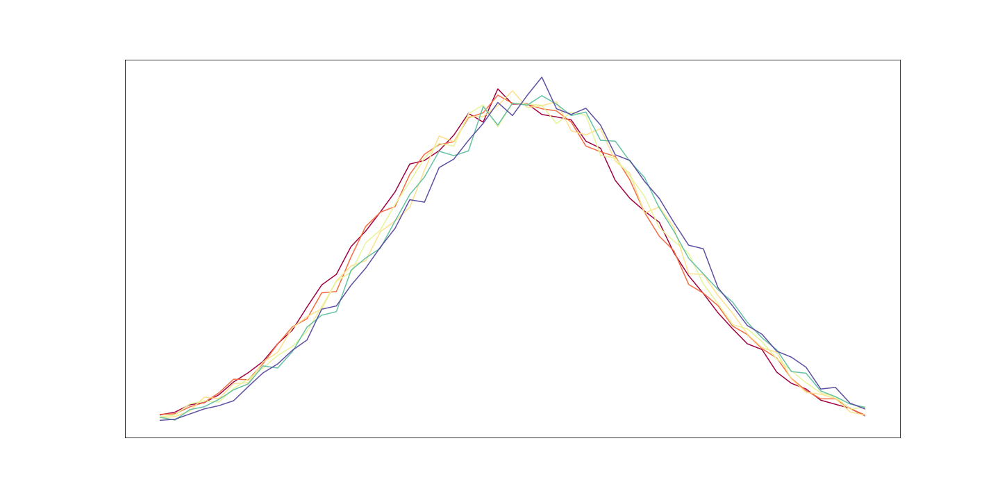
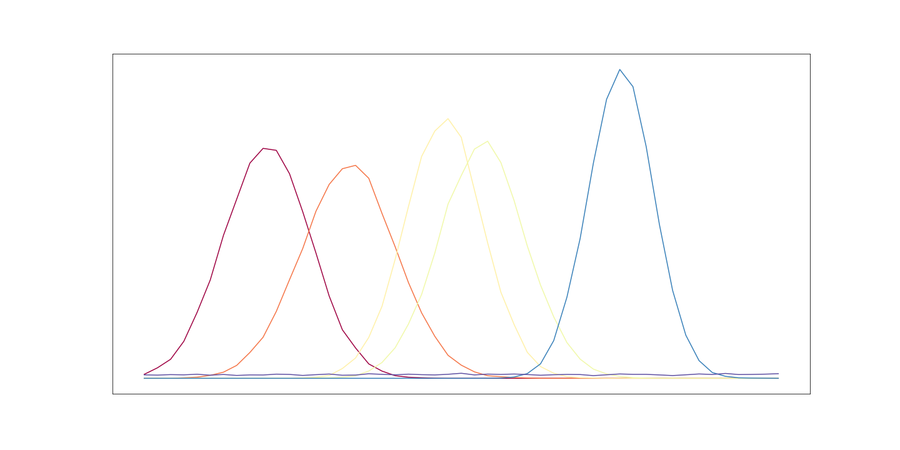
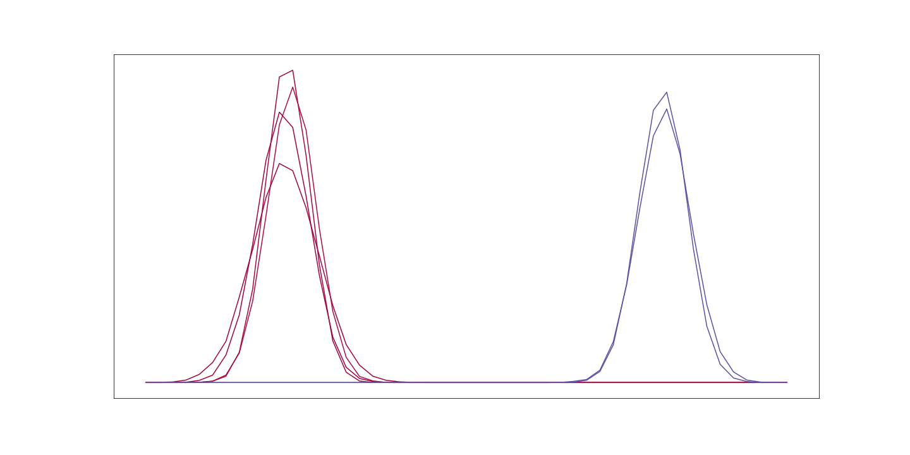

<div align="center">

# Incoherence

**Measuring complexity and self-organisation by asking a simple question:
does the average still describe what actually happens?**

[](https://www.mdpi.com/1099-4300/26/8/683)
[](https://www.mdpi.com/1099-4300/25/12/1605)
[](https://timjdavey.com/incoherence/)
[](#running-it)
[](LICENSE)

</div>

<br>

<table>
  <tr>
    <td width="33%"></td>
    <td width="33%"></td>
    <td width="33%"></td>
  </tr>
  <tr>
    <td align="center"><b>Low incoherence</b><br><sub>Every run looks the same, so the average is a fair summary of any one of them.</sub></td>
    <td align="center"><b>High incoherence, low cohesion</b><br><sub>Every run does its own thing, and the average describes none of them.</sub></td>
    <td align="center"><b>High incoherence, high cohesion</b><br><sub>The runs disagree, but they organise themselves into a few clear camps.</sub></td>
  </tr>
</table>

## Start here

The primers are the best way in. They explain the big picture with no equations or jargon, using
interactive illustrations, and they're worth reading before the papers.

<table>
  <tr>
    <td width="50%" valign="top">
      <h3><a href="https://timjdavey.com/incoherence/">Complexity, and how to measure it</a></h3>
      <p>What makes a system complex, why entropy alone can't capture it, and how comparing an
      ensemble of runs leads to Incoherence. Includes practical, real and business examples.</p>
      <p>📖 <a href="https://timjdavey.com/incoherence/">Read the primer</a> · 📄 <a href="https://www.mdpi.com/1099-4300/26/8/683">Read the paper</a></p>
    </td>
    <td width="50%" valign="top">
      <h3><a href="https://timjdavey.com/cohesion/">Self-organisation, and how to measure it</a></h3>
      <p>What it means for a system to organise itself, how that changes the decisions you make
      about it (with climate change as the example), and how Cohesion is built.</p>
      <p>📖 <a href="https://timjdavey.com/cohesion/">Read the primer</a> · 📄 <a href="https://www.mdpi.com/1099-4300/25/12/1605">Read the paper</a></p>
    </td>
  </tr>
</table>

## What is this?

Run a complex system twice from the same starting point and it can end up somewhere completely
different, so its average outcome may describe nothing that actually happens. **Incoherence**
measures how much an ensemble of runs disagree with each other, and **Cohesion** measures whether
that disagreement is random or organised into a few recognisable patterns.

This repository is the code behind both papers: `ensemblepy`, the library that calculates the
measures, the simulations used to test them, and the notebooks that produced every figure.

> [!NOTE]
> **Want to use `ensemblepy` for real? Get in touch.**
> This code was written to produce the results in the papers. It wasn't designed to be used more
> widely, and it isn't built for production workloads or large datasets, so expect rough edges,
> research-grade APIs and a few stale tests. If you'd like to use Incoherence or Cohesion in your
> own work, please [open an issue](https://github.com/timjdavey/incoherence/issues/new) and tell
> me about it. I'd gladly work with you to rebuild it into something polished, well tested and
> performant.

## A quick taste

`ensemblepy` takes a list of ensembles, where each ensemble is the list of observations from one
run of your system, and returns the measures. The example below builds three systems of ten runs
each: one where every run behaves the same, one that splits into two camps, and one where every
run wanders off on its own.

```python
import numpy as np
import ensemblepy as ep

rng = np.random.default_rng(1)

same    = [rng.normal(0, 1, 500) for _ in range(10)]
camps   = [rng.normal(3 if i % 2 else -3, 1, 500) for i in range(10)]
scatter = [rng.normal(rng.uniform(-4, 4), rng.uniform(0.3, 2), 500) for _ in range(10)]

for name, runs in [("same", same), ("camps", camps), ("scatter", scatter)]:
    m = ep.Continuous(runs, metrics=("incoherence", "cohesion"))
    print(f"{name:8} incoherence={m.incoherence:.2f}  cohesion={m.cohesion:.2f}")
```

```text
same     incoherence=0.03  cohesion=0.95
camps    incoherence=0.57  cohesion=0.80
scatter  incoherence=0.45  cohesion=0.30
```

The identical runs are coherent (and trivially cohesive, since they form a single group). The
two-camp system is incoherent but highly cohesive, while the scattered system is incoherent with
little structure to lean on. Use `ep.Discrete(observations, bins)` for categorical or binned data,
`ep.Collection(histograms)` if you already have distributions, and `ep.Correlation(x, y)` to use
incoherence as a correlation measure. The one-liners `ep.incoherence(discrete, ...)` and
`ep.cohesion(discrete, ...)` return a single number.

## What's in the repo

```text
ensemblepy/              the measures
├── continuous.py        Continuous: ensembles of real-valued observations
├── discrete.py          Discrete: binned or categorical observations, plus chi² comparisons
├── collection.py        Collection: start from histograms rather than raw observations
├── correlation.py       Correlation: incoherence as a correlation coefficient for x, y data
├── stats.py             the Incoherence and Cohesion calculations themselves
├── entropy.py           Shannon, pooled and per-ensemble entropies
├── densityvar.py        density variance, the continuous analogue of entropy
├── divergences.py       Jensen–Shannon and the other divergences used along the way
├── bins.py, plots.py    binning and plotting helpers
└── tests/

simulations/             the systems used to test the measures (mostly built on Mesa)
├── daisy_world/         Daisyworld, the classic self-regulating planet
├── wealth/              the Boltzmann wealth model of agents trading money
├── automata/            one-dimensional cellular automata, by Wolfram rule number
├── graphs/              Erdős–Rényi random graphs and their tipping point
├── fab/                 a semiconductor factory line of parcels passing through noisy machines
├── snowflake/           generated snowflakes with tunable symmetry
└── ideal_gas/           particles bouncing around a box

notebooks/               the analysis and figures behind the papers
├── incoherence/         the Incoherence paper, numbered by draft section
├── cohesion/            the Cohesion paper
├── continuous_entropy/  density variance and its dimensional invariance
├── chi_squared/         comparisons with chi², ANOVA and Kruskal–Wallis
└── correlation_coeff/   Incoherence as a correlation measure
```

Each part of the Incoherence paper's results has a notebook behind it. The notebooks in
[`notebooks/incoherence/`](notebooks/incoherence/) carry the numbering from an earlier draft, so
the table below maps them onto the sections of the published paper.

| Paper | What it tests | Systems | Notebooks |
| :-- | :-- | :-- | :-- |
| **5.1** Baseline | How incoherence compares with chi², ANOVA and friends | 📊 synthetic data, 🌼 Daisyworld | `chi_squared/`, 5 |
| **5.2** Disorder and order | Whether complexity is distinct from plain randomness | ◼️ cellular automata, 🕸️ ER graphs | 4.1 |
| **5.3** Criticality | Whether it peaks at tipping points and is sensitive to initial conditions | 🕸️ ER graphs, ◼️ cellular automata, 🌼 Daisyworld | 4.3, 4.4 |
| **5.4** Perturbation | How a self-regulating system responds to shocks | 🌼 Daisyworld | 4.5 |
| **5.5** Diversity of diversity | What happens as the system gains variety | 🌼 Daisyworld | 4.6 |
| **6** Decision making | A digital twin of a semiconductor factory | 🏭 factory line | `FAB` |

The wealth model notebooks (4.1 and 4.2) and the movie reviews notebook are earlier explorations
that didn't make it into the final paper. The Cohesion notebooks in
[`notebooks/cohesion/`](notebooks/cohesion/) cover the Daisyworld example, ergodicity, language
detection and the illustrative figures from the paper.

## Running it

The code is plain Python with no build step. Install the dependencies and open the notebooks from
inside their folder, since each one adds the repo root to its path through `nbsetup.py`.

```sh
pip install -r requirements.txt
jupyter notebook notebooks/
```

A few practical notes, given the code's age. The simulations were written against Mesa 2 (they
use `mesa.time.RandomActivation`, which Mesa 3 removed), so install `"mesa<3"` if a model fails to
import. The larger Daisyworld runs are generated by the scripts in `simulations/daisy_world/` and
written to `datasets/`, which is gitignored, so run those from the repo root before the notebooks
that load them. The tests run with `python -m unittest`, though some of them predate later
refactors and no longer pass.

## Citing

If this work is useful to you, please cite the papers.

<details>
<summary><b>BibTeX</b></summary>

```bibtex
@article{davey2024incoherence,
  title   = {Incoherence: A Generalized Measure of Complexity to Quantify Ensemble Divergence in Multi-Trial Experiments and Simulations},
  author  = {Davey, Timothy},
  journal = {Entropy},
  volume  = {26},
  number  = {8},
  pages   = {683},
  year    = {2024},
  doi     = {10.3390/e26080683}
}

@article{davey2023cohesion,
  title   = {Cohesion: A Measure of Organisation and Epistemic Uncertainty of Incoherent Ensembles},
  author  = {Davey, Timothy},
  journal = {Entropy},
  volume  = {25},
  number  = {12},
  pages   = {1605},
  year    = {2023},
  doi     = {10.3390/e25121605}
}
```

</details>

## Thanks

Particular thanks go to Carlos Gershenson, who proposed the 2012 measure of complexity that this
work builds on, and who generously edited the special issue of *Entropy* in which the Incoherence
paper was published.

## Licence

[MIT](LICENSE) © 2021 Tim Davey
